# **Third-Order Letter Approximation Model & ELIZA Chatbot**

## **Project Overview**

This project is made up of two main code sections:

- **Third-Order Letter Approximation Model**
    - Analyses trigram patterns in English texts.
    - Attempts to generate sentences that are grammatically realistic.
    - This allows us to understand how simple statistical models can identify and predict common sequences in language.
    - This is very interesting learn about, espceially for more advanced uses like in AI text generation.
  
- **ELIZA Chatbot**
    - Engages in empathetic, conversational interactions with users.
    - Responds based on user inputs using pattern matching.
    - This allows us to demonstrate how pattern matching and rule-based logic can help simulate meaningful, human-like conversations.
    - It is very interesting to learn about AI's role in real-world applications like real-time communication and mental health support.

Github Issues will be used to plan out my work and track my progress.

## **History**

### **Trigram Models**

- Trigram Models are statistical language models used to predict the probability of a sequence of three consecutive characters based on the preceding two. These models are part of n-gram models, which have been foundational in natural language processing (NLP).
- Probabilistic Approach: Trigram models use the function of the probability of a token depends only on the two preceding tokens, simplifying calculations and making them suitable for real-world applications.
- Applications in AI: Before neural network-based approaches became the norm, trigram models were standard in language modeling, significantly influencing the development of modern NLP tools like predictive text keyboards.
- Trigram models represent a simpler yet powerful method for understanding sequential patterns in text. They serve as a gateway to more advanced statistical and machine learning models.

### **ELIZA Chatbot**
- ELIZA was one of the first chatbots ever created, developed by Joseph Weizenbaum in 1966 at the Massachusetts Institute of Technology (MIT). It simulated a psychotherapist, responding to user inputs with questions and reflections.

- Early Development: ELIZA used simple pattern-matching techniques and substitution rules to analyze and respond to user text.This allowed it to give the illusion of understanding.
- Impact: Weizenbaum created ELIZA partly to demonstrate the superficiality of human-computer interactions. However, many users found the bot compelling, sparking debates about the ethics of AI in personal and emotional situations.
- Legacy: ELIZA laid the groundwork for modern chatbots and conversational AI.

## **Features**

### **Third-Order Letter Approximation Model**

- Text Cleaning: Accesses a Gutenburg text and returns a cleaned version of it which only contains uppercase letters, single spaces, and periods.
- Trigram Model: This is gerenrated by counting each sequence of three characters in the cleaned test, a count of each unique trigram is then kept in a dictionary.
- Text Generation: Using an initial seed of "TH", a new text is produced using trigram-based probabilities.
- Text Analysis: New Text is analysed to see what percentage of it contains recognisable English words.
- Trigram Model Export: Model is saved as a JSON file for future reuse.

### **ELIZA Chatbot**
- Setup to discuss a person's feelings and why they are feeling that way.
- Recognises emotion from messages and responds appropriately and empathetically.
- Uses Regex for pattern matching responses.
- Memory system, randomised responses and a typing indicator are used to try to simulate a human responder.
- Deployed on Github Pages so it can be used from any browser.

## **Installation and Deployment**

### **Third-Order Letter Approximation Model**

- Clone repository: git clone https://github.com/Cpgeragh/Emerging-Technologies.git.
- Open in Visual Studio Code.
- Install latest verison of python.
- Install required libraries: pip install -r requirements.txt.
- Copy texts you want to process into data/ directory.

### **ELIZA Chatbot**

- Clone repository: git clone https://github.com/Cpgeragh/Emerging-Technologies.git.
- Open in Visual Studio Code.
- Install latest verison of python.

## **How to Run**

### **Third-Order Letter Approximation Model**

- Execute each cell in order using ctrl + return.
- This will build the trigram model, generate the new text, analayse the real word count percentage , and export the model as trigrams.json.

### **ELIZA Chatbot**

- Deploy the chatbot locally: python -m http.server 5500.
- Open http://localhost:5500/eliza/ to access the chat.

#### Alternatively

- Access via Github Spaces: https://cpgeragh.github.io/Emerging-Technologies/

## **Expected Outputs and Demonstration**

### **Third-Order Letter Approximation Model**

- This is an example of the Trigram model working, we can see the texts being cleaned, the new text being generated, the Trigrams being extracted and then the real word analysis being completed. 

    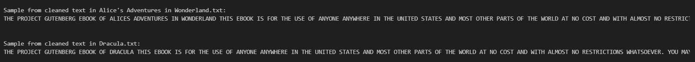 
    
    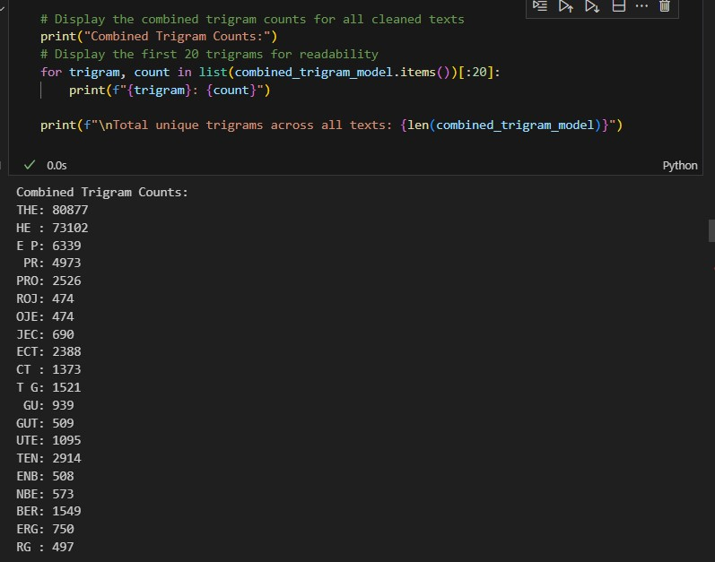
    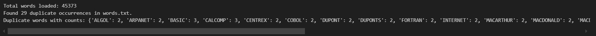
    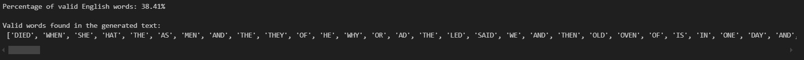

### **ELIZA Chatbot**

#### ELIZA in Action

- This is an example of a user interacting with the ELIZA chatbot on the web interface. It shows the responsive nature of the bot and the UI details that make the bot seem more human-like.

    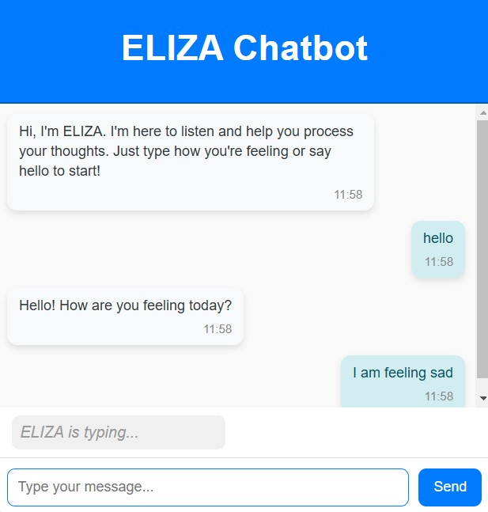 
    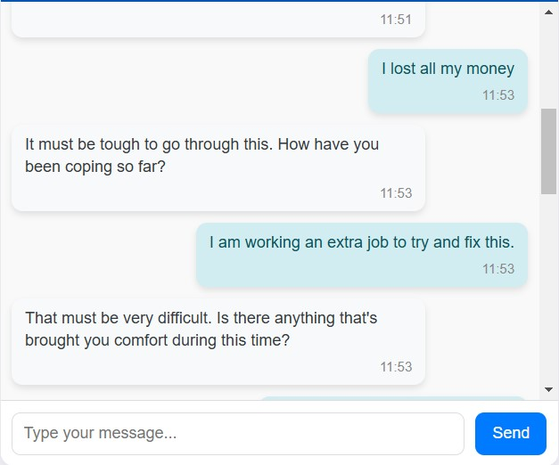
    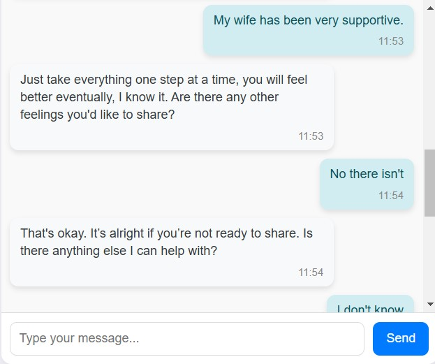
    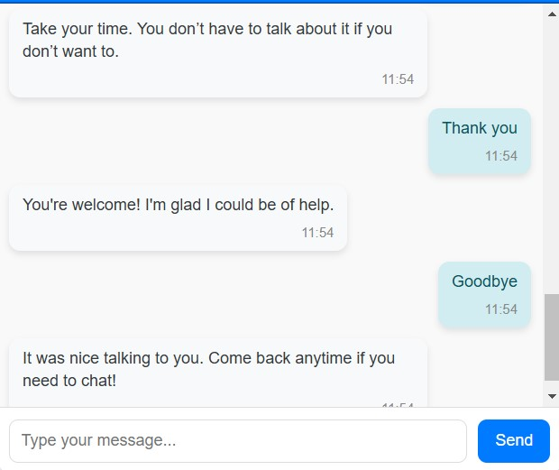

## **Development Difficulties**

### **Third-Order Letter Approximation Model**

#### Handling Edge Cases in Text Cleaning

- Challenge: The input texts contained special characters and non-ASCII symbols, making the cleaning process complex.
- Solution: A rigorous text cleaning function was implemented to filter out unwanted characters and normalize the text. This ensured that the model processed consistent and usable input.
- Reflection: Fine-tuning the cleaning patterns required a lot of testing, as it had to be certain that important characters like spaces and periods were retained while other elements weren't missed unexpectadly.

#### Valid Word Percentage Analysis

- Challenge: Determining the percentage of valid English words in the generated text required loading and processing a large word list efficiently.
- Solution: A set-based lookup was implemented for the word list, which improved the performance of the comparison step. Additionally, tests were added to ensure the accuracy of the word list and checking for any duplicate words in it that might throw off valid word counts.
- Reflection: The importance of optimizing operations when working with large datasets is clear to see and very nescessary.

### **ELIZA Chatbot**

#### Balancing Simplicity and Realism

- Challenge: ELIZA relies on simple rule-based logic using regular expressions, but achieving realistic and engaging conversations with such a system was difficult.
- Solution: A memory system was developed that tracked the user's last emotion and allowed follow-up responses to feel more personalized and human-like. Randomized responses also added variety to conversations, reducing the feeling of repetitiveness.
- Reflection: While ELIZA is not a true AI, small enhancements like memory and follow-ups made it much more engaging.

#### Emotion Detection and Ambiguity

- Challenge: Users often input ambiguous or multi-emotion messages which made it hard to determine the correct response.
- Solution: Responses to address the most prominent emotions in a message were prioritised. For ambiguous inputs, fallback responses were added to encourage users to clarify or share more.
- Reflection: This required refining the regex patterns and adding fallback logic.

#### User Experience Enhancements

- Challenge: Making the chatbot feel human-like required features such as a typing indicator and natural response delays.
- Solution: A visible typing indicator and a 1-second delay before responses was added, simulating a human responder.
- Reflection: Small improvements had a good impact on the chatbot’s realism, showing how important design details are for user engagement.

## **Testing**

### **Third-Order Letter Approximation Model Examples**

    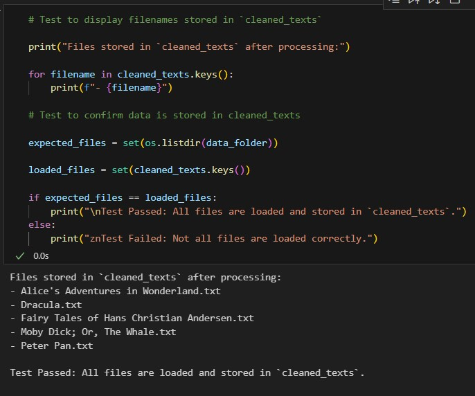 
    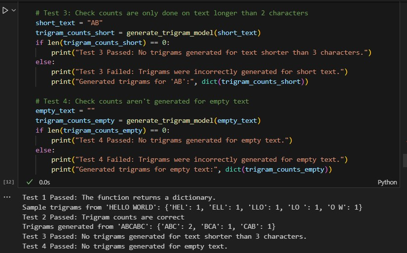
    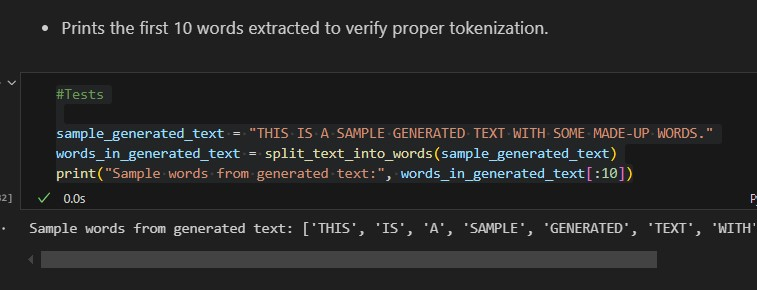

### **ELIZA Chatbot**

    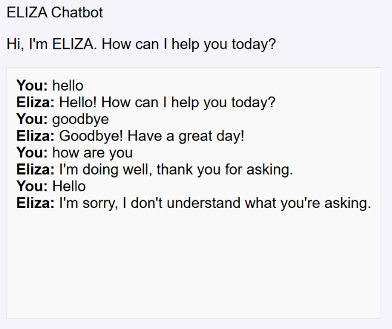 
    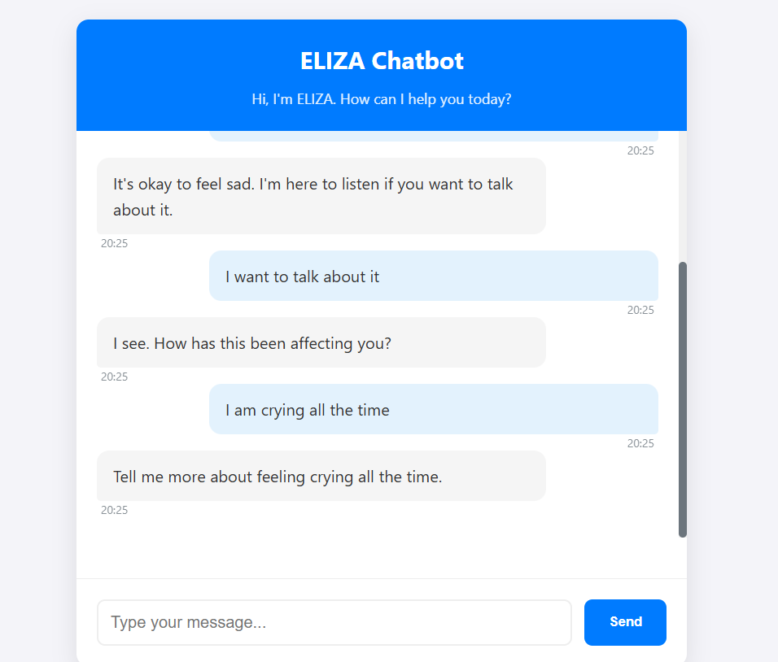
    

## **Bibliography**